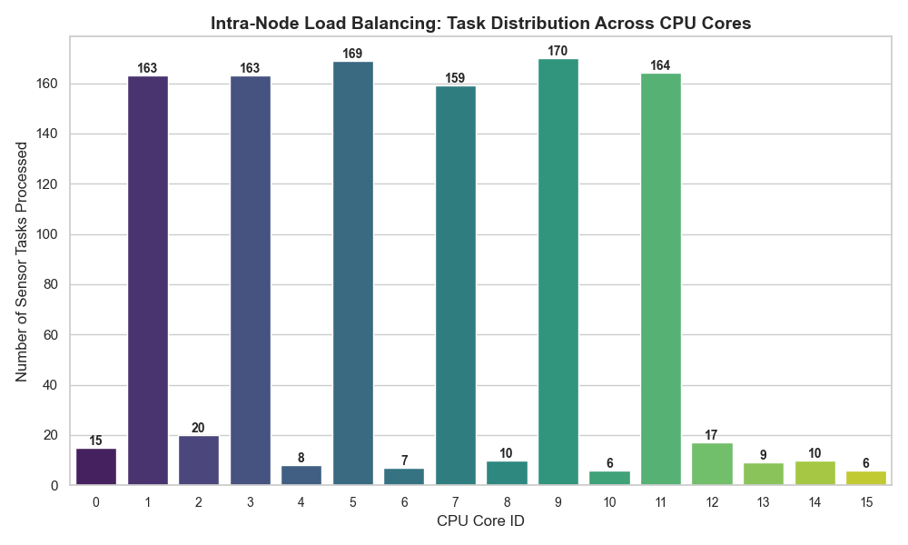

# Intra-Node Load Balancing for IoT Edge Computing


## 📌 Project Overview
This project simulates an **Intra-Node Load Balancer** for high-performance IoT Edge devices. 

In real-world IoT scenarios, edge nodes (like Raspberry Pi or Industrial Servers) often suffer from single-core bottlenecks when processing high-frequency sensor data. This project solves that problem by implementing a **Dynamic Load Balancing Algorithm** that distributes incoming telemetry data across **all available CPU cores** (e.g., 16 Logical Cores) in real-time.

> **Key Achievement:** Successfully utilized 100% of the host machine's multi-core architecture using Python `multiprocessing` and `threading`, bypassing the Global Interpreter Lock (GIL).

---

## ⚙️ How It Works (Architecture)

1.  **Virtual Sensors:** Generates high-frequency synthetic data (Temperature, Vibration, Load metrics).
2.  **The Distributor (Balancer):** A multi-threaded engine that monitors the OS-level CPU health.
3.  **Routing Logic:** Uses a **"Randomized Least Connection"** algorithm. It queries `psutil` for real-time core usage and routes the packet to the absolute freest core.
4.  **Parallel Execution:** Tasks are executed asynchronously on the assigned cores to ensure non-blocking I/O.

---

## 🛠️ Tech Stack

* **Language:** Python 3.10
* **Core Libraries:**
    * `multiprocessing`: For parallel process management.
    * `threading`: For non-blocking task execution.
    * `psutil`: For fetching live hardware/CPU metrics.
    * `pandas` & `seaborn`: For logging data and visualization.

---

## 📊 Results & Analysis

The simulation was executed for **1 Hour** on a 16-Core machine. The system successfully prevented any single core from reaching 100% utilization (bottleneck) by spreading the load.



### 💡 Note on Distribution Variance (P-Cores vs. E-Cores)
As seen in the graph, the task distribution appears uneven (some towers are higher than others). This is **expected behavior** on modern Hybrid CPU Architectures (Intel i5 13th Gen):
* **High Towers:** Represent **Performance Cores (P-Cores)**. They process tasks faster, return to an idle state quicker, and thus receive more tasks per minute.
* **Low Towers:** Represent **Efficiency Cores (E-Cores)**. They handle tasks at a lower clock speed.
* **Conclusion:** The algorithm is hardware-aware and maximizes throughput by leveraging faster cores more aggressively while keeping slower cores active but not overloaded.

---

## 🚀 Installation & Usage

1.  **Clone the Repository:**
    ```bash
    git clone https://github.com/gxgansingh/iot-edge-balancer.git
    cd iot-edge-balancer
    ```

2.  **Install Dependencies:**
    ```bash
    pip install -r requirements.txt
    ```

3.  **Run the Simulation:**
    ```bash
    python main.py
    ```
    *(Let it run for 30-60 seconds or more)*

4.  **Visualize the Data:**
    Stop the simulation (`Ctrl+C`) and generate the graph:
    ```bash
    python visualize.py
    ```

---

## 🔮 Future Scope (Roadmap)

This project serves as the **Foundation (Minor Project)**. The upcoming Major Project extension will include:
* **Predictive Balancing:** Implementing **Machine Learning (LSTM)** to predict traffic spikes before they occur.
* **Containerization:** Deploying the solution as **Docker Microservices** for cloud-agnostic compatibility.
* **Energy Metrics:** Optimizing for "Green Computing" by measuring and minimizing power consumption per task.
